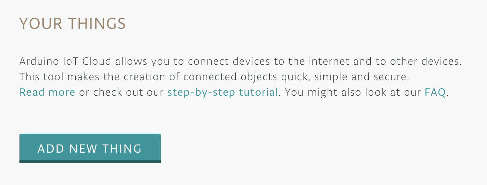
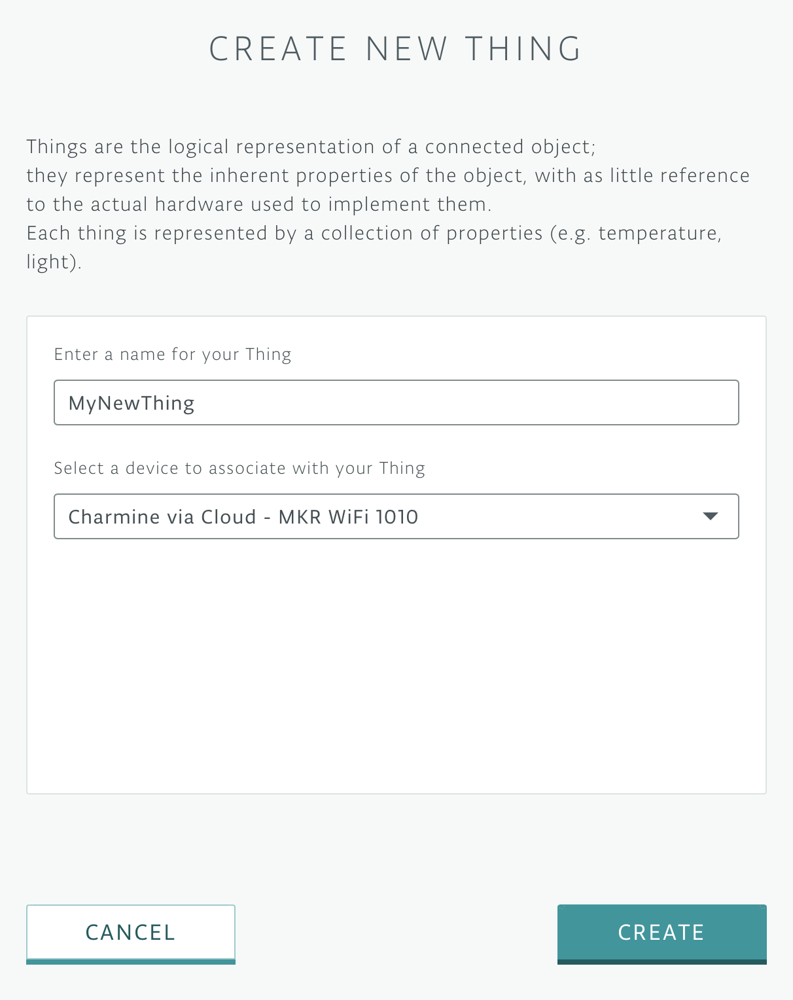
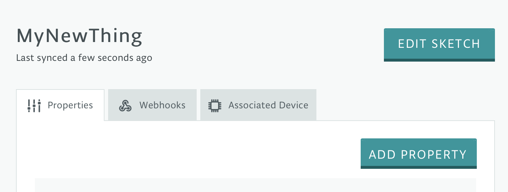
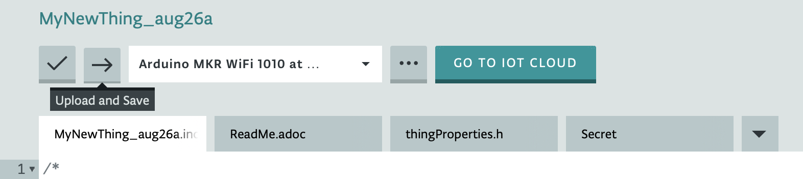

# CascadiaJS Heroku Arduino Workshop

## Create an 'On air' indicator for your home office using **Arduino + Heroku**

1.  Follow the instructions on the box to create your Arduino account, register the kit, and connect it to your computer

2.  Go to [Your Things](https://create.arduino.cc/iot/things) in your Arduino IoT account and click "Add New Thing" 

3.  Enter a name for your new Thing and set it to be associated with your new device "MKR WiFi 1010" 

4.  Create the following properties for your new Thing 

 

Make sure that all the "Character String" properties have the following settings 

 And that the "pendingMessage" property has the following settings 

5.  Click "Edit Sketch" 

6.  Enter the WiFi credentials in the "Secret" tab 

7.  Copy and paste the contents of [this .ino file](public/Heroku_Arduino_Demo.ino) into the main .ino file of your sketch and click "Upload and Save" 

8.  [Create a new API and download the resulting Client ID and Secret](https://create.arduino.cc/iot/things)  

9.  Click the button below to deploy your Heroku app. Use the Client ID and Secret that you downloaded in the previous step.
    

